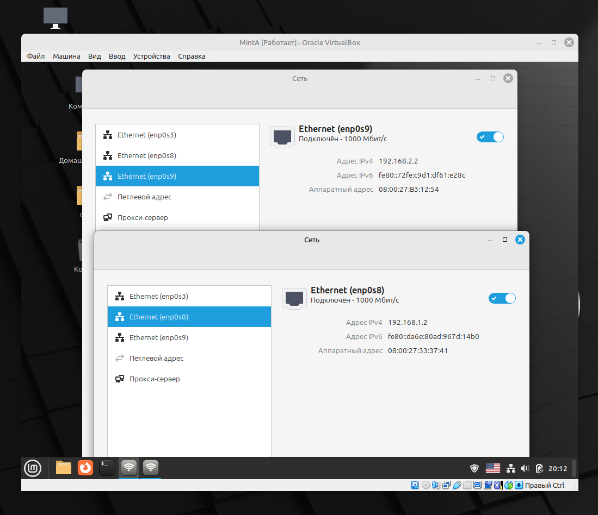
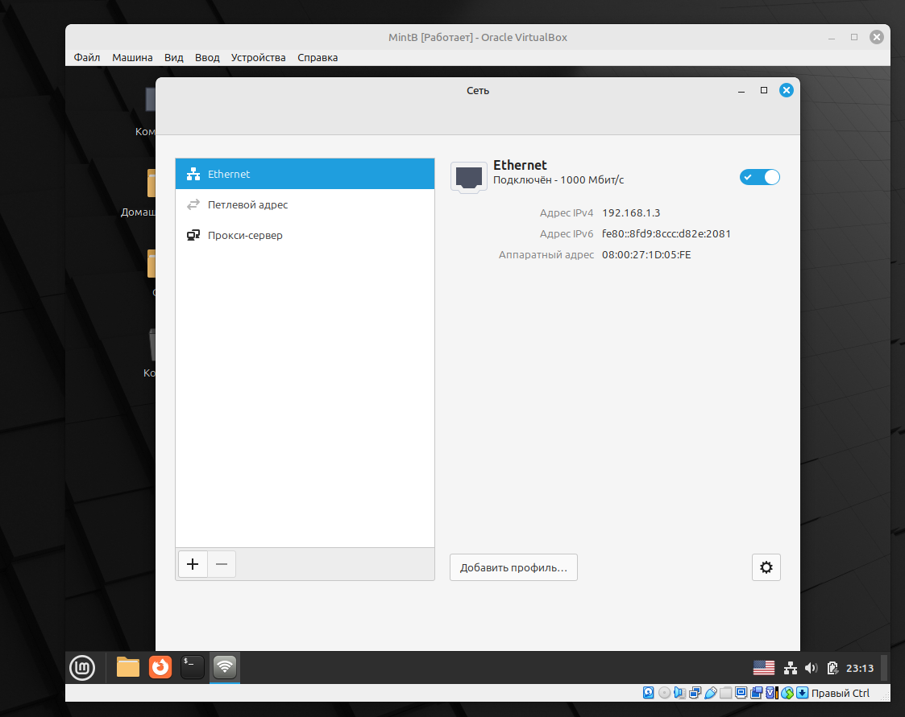
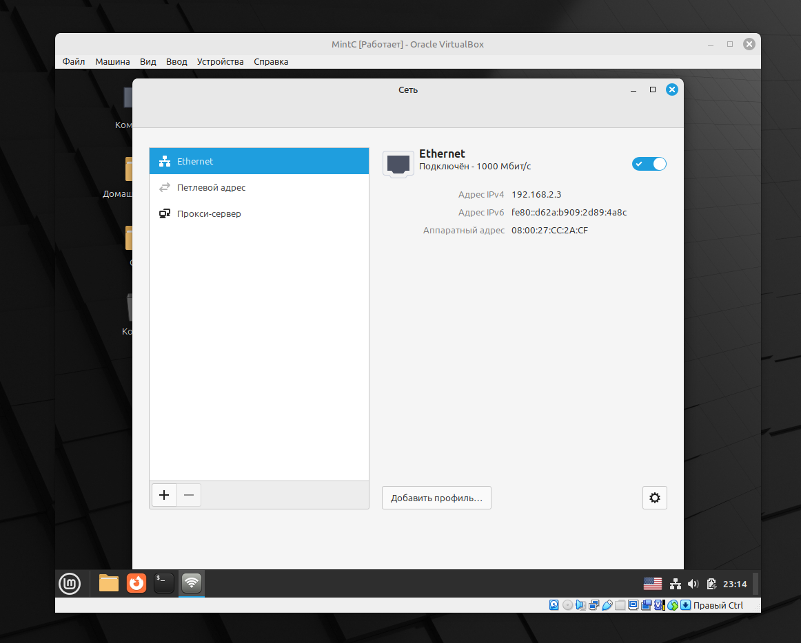
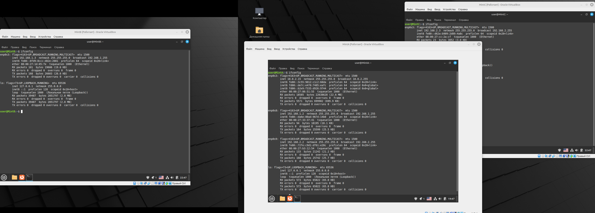
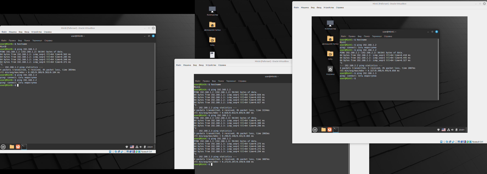
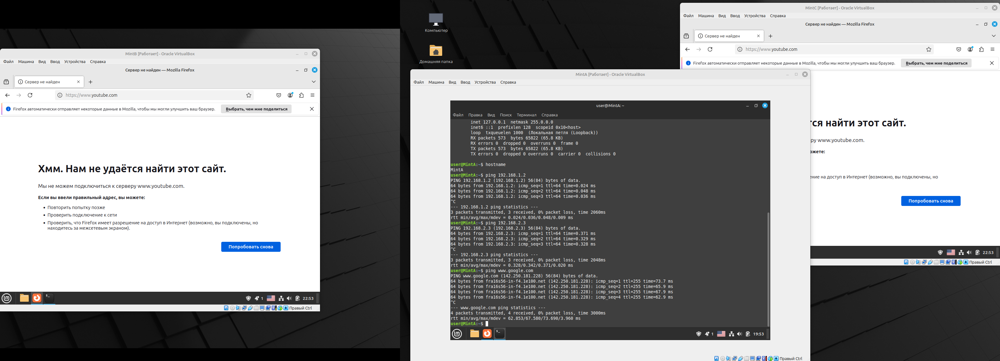

# Лабораторная 3
В VirtualBox через настройки сети я создала 2 внутренних сети для соединения машин (А и В) и (А и С), также у машины А есть доступ в интернет через NAT.
Потом после запуска виртуальных машин я присвоила им разные ip-адреса (машине А - 2 адреса, для 2х разных внутренних сетей, в которых она находится): <br><br>
 <br><br>
 <br><br>
 <br><br>
Далее через команду ```ifconfig``` проверила, в каких сетях находятся машины: <br><br>
 <br><br>
Далее через команду ```ping``` проверила, к каким машинам у каких есть доступ: <br><br>
 <br><br>
Так же через ```ping``` проверила,если ли у машины А выход в интернет, и попыталась открыть интернет вкладки на машинах В и С, не получилось, 
потому что у них нет доступа в интернет (не сказано выдавать):<br><br>
 <br><br>
